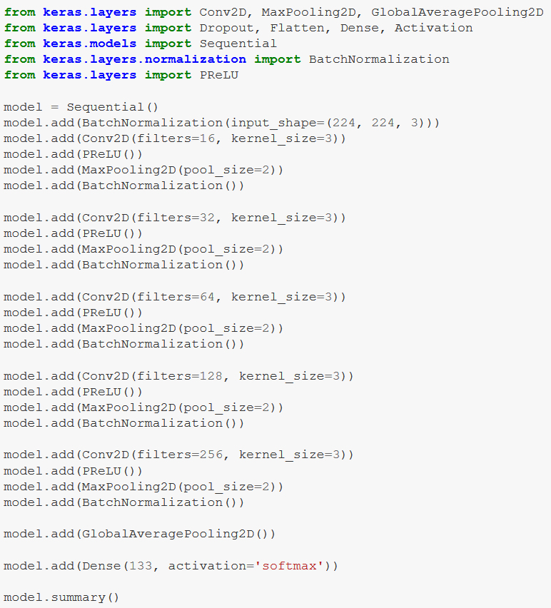
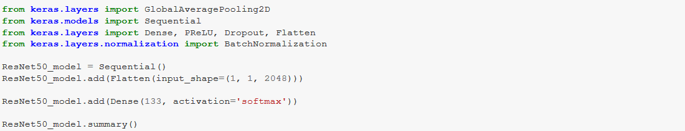
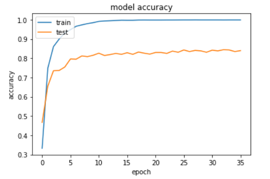
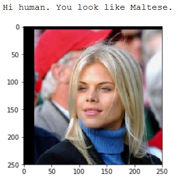
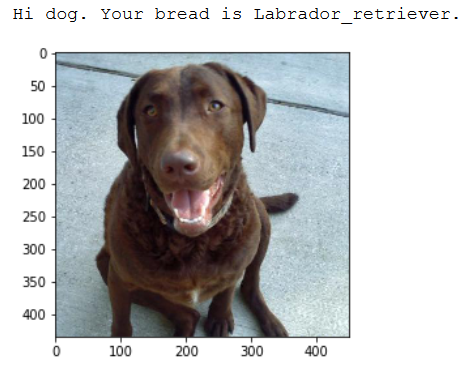
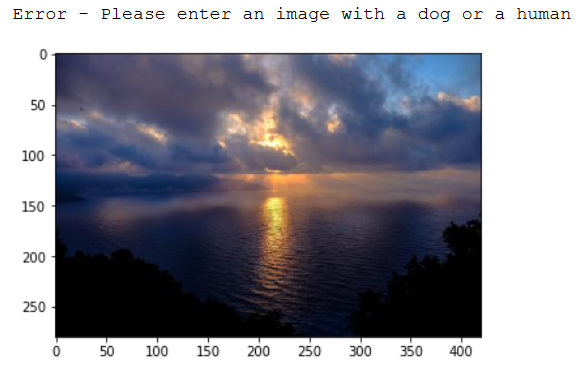

# Python-Classification-Transfer-Learning-DBC

The project aims to develop code that will accept any user-supplied image as input. If a dog is detected in the image, it will provide an estimate of the dog's breed. If a human is detected, it will provide an estimate of the dog breed that is most resembling.

Project Steps:
0. Import Datasets
1. Detect Humans
2. Detect Dogs
3. Create a CNN to Classify Dog Breeds (from Scratch)
4. Use a CNN to Classify Dog Breeds (using Transfer Learning)
5. Create a CNN to Classify Dog Breeds (using Transfer Learning)
6. Write your Algorithm
7. Test Your Algorithm
    
### CNN model from scratch

### ResNet50 Transfer learning model

### Results

